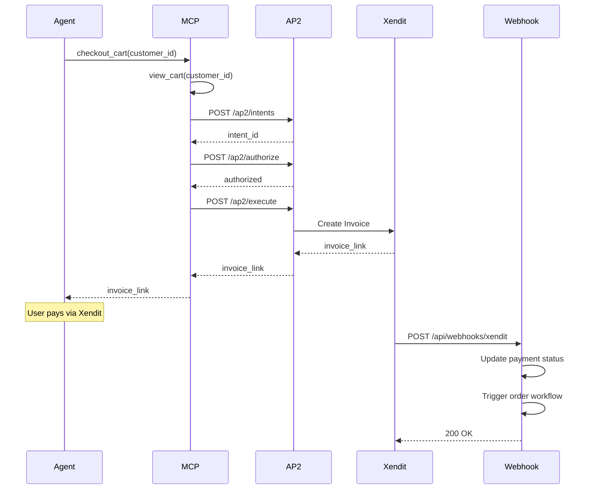

# AP2 Integration with MCP Server

This document describes the AP2 (Payment Protocol) integration with the MCP (Model Context Protocol) server for the Order Processing Pipeline.

## Overview

The AP2 integration allows the MCP server to create Xendit invoices for cart checkouts using the existing AP2 adapter service. The integration follows a non-blocking pattern where the invoice link is returned immediately, and payment status updates are handled via webhooks.

## Architecture

```
MCP Server -> AP2 Adapter -> Xendit API
     ↓              ↓           ↓
   Cart Tools    Payment     Invoice
                Intent       Creation
```

## Components

### 1. MCP Server Updates

**New Tool: `checkout_cart`**
- Integrates with existing cart tools (`view_cart`, `add_to_cart`, etc.)
- Calls AP2 adapter endpoints to create payment intents
- Returns invoice link immediately
- Does not wait for payment completion

**AP2 Helper Function**
- `make_ap2_request()` - Handles HTTP requests to AP2 adapter
- Configured via `AP2_BASE` environment variable (default: `http://127.0.0.1:7010`)

### 2. AP2 Adapter Endpoints

The integration uses these existing AP2 adapter endpoints:

- `POST /ap2/intents` - Create payment intent
- `POST /ap2/authorize` - Authorize payment intent  
- `POST /ap2/execute` - Execute payment and get invoice link
- `GET /ap2/status/{payment_id}` - Get payment status
- `POST /ap2/refunds` - Process refunds

### 3. Webhook Integration

**Existing Xendit Callback**
- Endpoint: `POST /api/webhooks/xendit`
- Handles payment status updates (PAID, EXPIRED, FAILED)
- Updates database and triggers Restate workflows
- Resolves awakeables to continue order processing

## Usage

### Environment Setup

```bash
# Set AP2 adapter base URL
export AP2_BASE=http://127.0.0.1:7010

# Set Xendit callback token (optional)
export XENDIT_CALLBACK_TOKEN=your_callback_token
```

### MCP Tool Usage

```python
# Example checkout flow
checkout_result = await checkout_cart(customer_id="customer-001")
```

### Expected Response

```
✅ Checkout completed successfully!

**Order ID:** ORD-abc12345
**Payment ID:** pay_xyz67890
**Status:** PENDING

🔗 **Invoice Link:** https://checkout.xendit.co/web/...

Please complete the payment using the invoice link above. 
I'll notify you once the payment is confirmed.
```

## Flow Diagram



## Testing

Run the integration test:

```bash
python test_ap2_integration.py
```

The test script will:
1. Add items to cart
2. View cart contents
3. Test AP2 endpoints directly
4. Test the complete checkout flow

## Key Features

### ✅ Non-blocking Checkout
- Returns invoice link immediately
- No waiting for payment completion
- Uses webhook callbacks for status updates

### ✅ Existing Tool Compatibility
- All existing cart tools remain unchanged
- `view_cart`, `add_to_cart`, `update_cart_item`, `remove_from_cart`
- New `checkout_cart` tool integrates seamlessly

### ✅ AP2 Adapter Integration
- Uses existing AP2 endpoints only
- No duplicate crypto or payment logic
- Follows AP2 protocol specifications

### ✅ Webhook-driven Updates
- Xendit callbacks update payment status
- Triggers Restate workflows automatically
- Resolves awakeables for order continuation

## Error Handling

The integration includes comprehensive error handling:

- **Empty Cart**: Returns error if cart is empty
- **AP2 Errors**: Handles HTTP errors from AP2 adapter
- **Missing Invoice Link**: Validates invoice link presence
- **Database Errors**: Handles database connection issues

## Security

- **Callback Verification**: Optional Xendit callback token verification
- **CORS Support**: Proper CORS headers for web requests
- **Input Validation**: Validates all input parameters

## Monitoring

Log messages are available for debugging:

```
[AP2] Creating payment intent: intent_id=pi_abc123
[AP2] Authorizing intent: intent_id=pi_abc123
[AP2] Executing payment: intent_id=pi_abc123
[Xendit Webhook] Received payload: status=PAID, external_id=pay_xyz789
```

## Future Enhancements

- Payment status polling (if needed)
- Refund integration via MCP tools
- Multiple payment provider support
- Enhanced error recovery mechanisms
